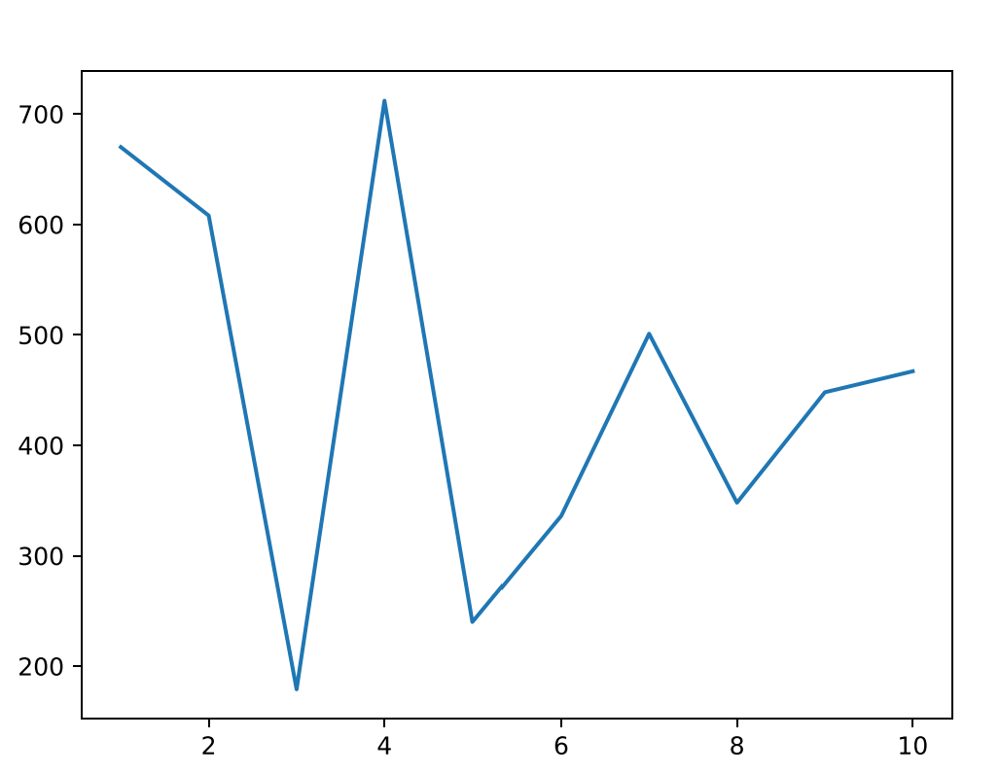

# Fundamentals of Programming – Summary 

## Table of Contents

1. [Week 1](#week-1)
2. [Week 2](#week-2)
3. [Week 3](#week-3)
4. [Week 4](#week-4)
5. [Week 5](#week-5)
6. Week 6 - Study week
6. [Week 7](#week-7)
7. [Week 8](#week-8)
8. [Week 9](#week-9)
9. [Week 10](#week-10)
10. [Week 11](#week-11)
11. Week 12 - Study week

### Week 1
#### Introduction to Programming
- **Comments**: Using `#` to add comments in code.
- **Print Function**: Using `print()` to display output.
- **Strings**: Understanding strings and their manipulation.
- **String Concatenation**: Joining multiple strings together using `+`.
- **Integers and Floats**: Introduction to numeric data types: whole numbers (integers) and decimal numbers (floats).
- **Variables**: Assigning values to variables and changing them.
- **Data Types**: Introduction to integers and floats.
- **Arithmetic Operations**: Basic operations like addition, subtraction, multiplication, division, modulus, and exponentiation.


#### Python functions mentioned in the workshops
1. `print()`: Outputs messages to the console.
2. `type()`: Returns the type of a variable.
3. `len()`: Returns the number of items in a collection (e.g., lists, strings).


#### More concepts in Week 1
##### Comments
```python
# character enables a comment  
# Comment on a single line

name = "Alice"  # variable name has the value of Alice  
```


##### print() Function
The `print()` function prints a message to the console or output.
```python
# Prints blank line  
print()  

# Prints message "Cheatsheet"
print("Cheatsheet")
```


##### Syntax
Covers Strings, Boolean, Lists, and so on.


##### Strings
Strings contain characters enclosed by single quotes `' '` or double quotes `" "`.
```python
# Single quotes
single = 'Single'  

# Double quotes  
double = "Double"  
```


##### String Concatenation
The plus sign `+` can add two `str` types or Strings (and not just numeric types).
```python
single = 'Single'
double = "Double"
# String Concatenation  
concatenate = single + double  # becomes "SingleDouble"
```

##### Integer (and Float)
- **Integer** must be a whole number, it can be 0, positive, or negative, but must be without decimals.
- **Float** is a number, it can be positive or negative, but must contain one or more decimals.
```python
# Integer or int  
height = 183  
weather = -6  
zero = 0  

# Float  
f = 1.33  

# If unsure, use type() function 
print(type(f))  # For example
```

##### Variables
Variables assign a value or store data using an equals sign `=`.
```python
# Valid variable names and assignment 
string_var = "String is here"  
int_var = 10  
float_var = 10.13  
bool_statement = False  

# Variable value can be changed
int_var = 12  
```

##### Arithmetic Operations
- `+` for addition
- `-` for subtraction
- `*` for multiplication
- `/` for division
- `%` for modulus (returns the remainder)
- `**` for exponentiation (number^number)
```python
# Arithmetic operations  
addition = 2 + 5  # 7  
subtraction = 30 - 40  # -10  
multiplication = 2 * 90  # 180  
division = 4 / 4.0  # 1.0  
modulus = 13 % 2  # 1  
exponentiation = 2 ** 3  # 8  
```

##### Modulo Operator (%)
Modulo operation, with a percent sign `%`, returns the remainder of the division operation.
1. `6 % 2` results in 0 because 6 divided by 2 would return 3, leaving no remainder.
2. `7 % 2` results in 1 because 7 divided by 2 is not evenly divisible, leaving 1 remainder.
3. `9 % 50000` results in 9 because 9 divided by 50000 is not evenly divisible, leaving 9 remainder.
```python
# Modulo operator % 
# Example 1  
zero = 6 % 2  # 0  
  
# Example 2  
one = 7 % 2  # 1  
  
# Example 3  
nine = 9 % 50000  # 9
```

##### Plus Equals
A shortcut to update a variable value can be done by using the plus equals sign `+=`.
```python
# Plus Equals (int)  
count = 0  
count += 1  # equivalent to count = count + 1  
  
# Plus Equals (str)  
data = "Plus "  
data += " Equals"  # equivalent to data = data + " Equals" 
```

##### Errors
PyCharm will (a) display the error type; and (b) information where the error has occurred.
```python
# If unsure, use type() function 
# ^^^^^^  
SyntaxError: invalid syntax  
```

##### NameError
NameError is produced when variable(s) were not defined.
```python
# NameError  
print(result)
```

##### SyntaxError
SyntaxError is produced when Python syntax is not followed.
```python
# SyntaxError  
result = 'Wrong quotes"
```

##### ZeroDivisionError
ZeroDivisionError occurs when a number (denominator) is divided by a 0 or 0.0.
```python
# ZeroDivisionError  
numerator = 50  
denominator = 0  
result = numerator / denominator
print(result)  
```

### Week 2
#### Control Flow
- **Introduction to Control Flow**: Managing the order in which code executes.
- **Flowcharts and Pseudocode**: Representing algorithms visually and in plain language.
- **Control Flow before Code**: Pseudocode and flowcharts to design control logic before coding.
- **Control Flow**: Understanding how the order of execution is determined in a program.
- **Conditional Statements**: Using `if`, `elif`, and `else` to execute code based on conditions.
- **Boolean Expressions**: Evaluating conditions that return True or False.
- **Logical Operators**: Using `and`, `or`, and `not` to combine conditions.
- **Relational Operators**: Using `==`, `!=`, `>`, `<`, `>=`, and `<=` to compare values.
- **If Statement**: Executing code based on a true condition.
- **Logical Operators**: Combining conditions with `and`, `or`, and `not`.
- **Else Statement**: Providing alternative code execution when `if` conditions are not met.
- **Else If Statement**: Handling multiple conditions with `elif`.

#### Python functions mentioned in the workshops
1. `input()`: Accepts user input from the console.
2. `int()`: Converts a string input to an integer.

#### More concepts in Week 2

##### Boolean - False
```python
# Empty, False, 0 None
```

##### Boolean – True
```python
# Any number (beside 0), True, String (that is not empty)
```

##### Equals and Not Equals
```python
test = ""
print(bool(test))  # False
'13' == 13  # False
```

##### If Statement
```python
day = 'Monday'  # Enter day here
if day == 'Monday':
    print('attend the Workshop')
```

##### Ask for User Input
```python
print('Enter your age: ')
age = input()  # stores String
age = int(age)  # converts to int
```

##### Logical Operators
1. `and`
2. `or`
3. `not`

###### Example
```python
print(not True)  # prints False
print(not False)  # prints True
```

##### Else Statement
```python
credits = 35  # Modify credits value here
if credits >= 1000:
    print("You are a Platinum member")
elif credits >= 500:
    print("You are a Gold member")
elif credits >= 250:
    print("You are a Silver member")
else:
    print("You are a Red member")
```

### Week 3
#### Loops
- **Introduction to Loops**: Repeating code multiple times.
- **Loops**: Understanding the concept of iteration.
- **For Loops**: [Using `for` loops for definite iteration over a sequence like lists or ranges.](https://atlas.org/api/v1/files?documentId=7e053b4f-7a58-41df-9d61-fc3553aaabad)
- **While Loops**: Using `while` loops for indefinite iteration until a condition is met.
- **Loop Control**: Using `break`, `continue`, and `else` statements to control loop execution.
- **Nested Loops**: Understanding loops within loops.

#### Python functions mentioned in the workshops
1. `range()`: Generates a sequence of numbers, often used in `for` loops.

#### More concepts in Week 3

##### Loops
1. **Indefinite**: where the number of times a loop is executed depends on the number of times a condition is met.
2. **Definite**: where the number of times a loop will be executed is declared in advance.

###### Example
```python
grades = [35, 50, 65, 85]
print(grades[0])  # 35
print(grades[1])  # 50
print(grades[2])  # 65
print(grades[3])  # 85
```

##### For Loops
A type of definite iteration that will know how many times to iterate the loop because our grades list contains a collection of elements or items with a predefined length.
```python
for g in grades:
    print(g)
```

##### One Line For Loops
```python
grades = [35, 50, 65, 85]
for g in grades: print(g)
```

##### Using Range in For Loops
```python
for temp in range(11):
    # Iterates 11 times, from 0 to 10
    print('I must attend my workshops')
```

###### Example
```python
for temp in range(11):
    print('Iteration number is: ' + str(temp))
# Output:
# Iteration number is: 0
# Iteration number is: 1
# Iteration number is: 2
# Iteration number is: 3
# Iteration number is: 4
# Iteration number is: 5
# Iteration number is: 6
# Iteration number is: 7
# Iteration number is: 8
# Iteration number is: 9
# Iteration number is: 10
```

##### While Loops
```python
iteration = 0
while iteration < 11:
    print('Iteration number is: ' + str(iteration))
    iteration = iteration + 1

grades = [35, 50, 65, 85]
iteration = 0
while iteration < len(grades):
    print(grades[iteration])
    iteration = iteration + 1
```

##### Loop Control - Break
```python
grades = [35, 50, 65, 85]
for grade in grades:
    print(grade)
    if grade < 50:
        break
# prints 35 because the break is after the print function
```

##### Loop Control - Continue
```python
grades = [35, 50, 65, 85]
for grade in grades:
    if grade < 50:
        continue
    print(grade)
# prints 50, 65, 85
```

##### Loop Control - Else
```python
grades = [35, 50, 65, 85]
for grade in grades:
    print(grade)
else:
    print('Completed the grades for loop.')
```

##### Nested Loops
```python
gradebook = [
    ['Jing', 35], 
    ['Jim', 50],
    ['Kerrie', 65],
    ['Rakesh', 85]
]
for student in gradebook:
    print(student)
    for detail in student:
        print(detail)
```

##### List Comprehension
```python
new_list = [name for name in students if 'i' in name]
```

###### Example
```python
new_list = [i for i in range(11)]
new_list = [i for i in range(11) if i > 5]
```

### Week 4
#### Lists
- **Introduction to Lists**: Creating and working with lists, a collection of elements.
- **Accessing List Elements**: Using indexing to access elements in a list.
- **Modifying List Elements**: Changing elements in a list through indexing or list methods.
 **Lists**: [Creating and using lists to store collections of items.](https://atlas.org/api/v1/files?documentId=7e053b4f-7a58-41df-9d61-fc3553aaabad)
- **List Methods**: Using methods like `.append()`, `.remove()`, and `.pop()`.
- **Accessing List Elements**: Understanding indexing and slicing.
- **Two Dimensional (2D) Lists**: Creating and manipulating lists of lists.
- **`zip()` Function**: Combining multiple lists into tuples using the `zip()` function.
- **Other Useful List Methods**: Exploring methods like `append()`, `insert()`, `remove()`, `pop()`, and `sort()`.
- **Length of a List**: Using `len()` to find the number of elements in a list.

#### Python functions mentioned in the workshops
1. `list()`: Converts other data types (like range) into a list.
2. `len()`: Returns the number of elements in a list.
3. `count()`: Returns the number of times a specified element appears in a list.
4. `append()`
5. `extend()`
6. `remove()`
7. `pop()`
8. `del`
9. `zip()`

#### [Python List Methods](https://www.geeksforgeeks.org/list-methods-python/)
1. `append()`: Used for adding elements to the end of the List.
2. `copy()`: Returns a shallow copy of a list.
3. `clear()`: Removes all items from the list.
4. `count()`: Counts the elements in the list.
5. `extend()`: Adds each element of an iterable to the end of the List.
6. `index()`: Returns the lowest index where the element appears.
7. `insert()`: Inserts a given element at a given index in a list.
8. `pop()`: Removes and returns the last value from the List or the given index value.
9. `remove()`: Removes a given object from the List.
10. `reverse()`: Reverses objects of the List in place.
11. `sort()`: Sorts a List in ascending, descending, or user-defined order.
12. `min()`: Calculates the minimum of all the elements of the List.
13. `max()`: Calculates the maximum of all the elements of the List.

#### [Python List/Array Methods](https://www.w3schools.com/python/python_ref_list.asp)
1. `append()`: Adds an element at the end of the list.
2. `clear()`: Removes all the elements from the list.
3. `copy()`: Returns a copy of the list.
4. `count()`: Returns the number of elements with the specified value.
5. `extend()`: Adds the elements of a list (or any iterable) to the end of the current list.
6. `index()`: Returns the index of the first element with the specified value.
7. `insert()`: Adds an element at the specified position.
8. `pop()`: Removes the element at the specified position.
9. `remove()`: Removes the first item with the specified value.
10. `reverse()`: Reverses the order of the list.
11. `sort()`: Sorts the list.

#### [Python Data Structures](https://docs.python.org/3/tutorial/datastructures.html)

##### Common List Methods:
1. `append(x)`: Add an item to the end of the list.
2. `extend(iterable)`: Extend the list by appending all the items from the iterable.
3. `insert(i, x)`: Insert an item at a given position.
4. `remove(x)`: Remove the first item from the list whose value is equal to x.
5. `pop([i])`: Remove the item at the given position in the list and return it.
6. `clear()`: Remove all items from the list.
7. `index(x[, start[, end]])`: Return zero-based index in the list of the first item whose value is equal to x.
8. `count(x)`: Return the number of times x appears in the list.
9. `sort(key=None, reverse=False)`: Sort the items of the list in place.
10. `reverse()`: Reverse the elements of the list in place.
11. `copy()`: Return a shallow copy of the list.

##### Additional Functions Mentioned:
12. `len(s)`: Return the length (the number of items) of an object.
13. `del s[i]`: Delete the item at a specific position.
14. `del s[i:j]`: Delete a slice from the list.
15. `max(iterable, *[, key, default])`: Return the largest item in an iterable.
16. `min(iterable, *[, key, default])`: Return the smallest item in an iterable.
17. `sum(iterable, /, start=0)`: Sums up the items of an iterable from left to right and returns the total.
18. `sorted(iterable, *, key=None, reverse=False)`: Return a new sorted list from the items in iterable.
19. `reversed(seq)`: Return a reverse iterator over the values of the given sequence.
20. `enumerate(iterable, start=0)`: Return an enumerate object.
21. `filter(function, iterable)`: Construct an iterator from elements of iterable for which function returns true.
22. `map(function, iterable, ...)`: Return an iterator that applies function to every item of iterable, yielding the results.
23. `zip(*iterables)`: Make an iterator that aggregates elements from each of the iterables.

##### Set Methods:
24. `add(x)`: Add an element to a set.
25. `remove(x)`: Remove an element from a set; it must be a member.
26. `discard(x)`: Remove an element from a set if it is a member.
27. `pop()`: Remove and return an arbitrary set element.
28. `clear()`: Remove all elements from this set.

##### Dictionary Methods:
29. `dict()`: Create a new dictionary.
30. `dict.clear()`: Remove all items from the dictionary.
31. `dict.copy()`: Return a shallow copy of the dictionary.
32. `dict.fromkeys(iterable[, value])`: Create a new dictionary with keys from iterable and values set to value.
33. `dict.get(key[, default])`: Return the value for key if key is in the dictionary, else default.
34. `dict.items()`: Return a new view of the dictionary’s items (key, value).
35. `dict.keys()`: Return a new view of the dictionary’s keys.
36. `dict.pop(key[, default])`: If the key is in the dictionary, remove it and return its value, else return default.
37. `dict.popitem()`: Remove and return a (key, value) pair as a 2-tuple.
38. `dict.setdefault(key[, default])`: Return the value of the key if it is in the dictionary; if not, insert key with a value of default and return default.
39. `dict.update([other])`: Update the dictionary with the key/value pairs from other, overwriting existing keys.
40. `dict.values()`: Return a new view of the dictionary’s values.

#### More concepts in Week 4

##### Summary of Python collections
1. **List**: “is a collection which is ordered and changeable (Mutable). Allows duplicate members.”
2. **Tuple**: “is a collection which is ordered and unchangeable. Allows duplicate members.”
3. **Set**: “is a collection which is unordered, unchangeable*, and unindexed. No duplicate members.”
4. **Dictionary**: “is a collection which is ordered** and changeable (Mutable). No duplicate members.”

##### List
- List is created using square brackets `[]`.
- Each item is separated by a comma `,`.
- Good Python practice: insert a space after each comma.
- Store a combination of different data types.
```python
list = ["String", 27, False, 25.65, [1, 2, 3, 4, "Count"], None]

# Create an empty list
list_empty = []
list_empty = list(())
```

##### List Methods / Class
```python
# list_name is our list
# .method() is a method of our list
# This example is for structure illustration,
# it will not work
list_name.method() 
AttributeError: 'list' object has no attribute 'method'

# Syntax for List methods
list.method(parameter)
```

##### Reference - Check Methods Documentation
Use the following official websites:
1. [Official Python Docs](https://docs.python.org/3/tutorial/datastructures.html)
2. [W3Schools Docs](https://www.w3schools.com/python/python_ref_list.asp)
3. [GeeksforGeeks Docs](https://www.geeksforgeeks.org/list-methods-in-python/)


##### List Method: .append()
```python
# adds an element to the end of a list
grades = [35, 50, 65, 85]
grades.append(67)
print(grades)  # Prints [35, 50, 65, 85, 67]
```

##### Adding Multiple Items to a List
```python
grades = [35, 50, 65, 85, 67]
grades += [76, 78, 52]  # OR grades = grades + [76, 78, 52]
grades.extend([68, 72])  # square brackets are used here and above
print(grades)  # prints [35, 50, 65, 85, 67, 76, 78, 52, 68, 72]
```

##### Accessing List Elements
- The first element in a list has an index of 0.
- Negative index can be used to access last element(s) of a list.
```python
students = ['Jing', 'Jim', 'Kerrie', 'Rakesh']
print(students[1])  # prints Jim
print(students[-1])  # prints Rakesh
```

##### Element Index and Negative Index Example:
| Element | Index | Negative Index |
|---------|-------|----------------|
| 'Jing'  | 0     | -4             |
| 'Jim'   | 1     | -3             |
| 'Kerrie'| 2     | -2             |
| 'Rakesh'| 3     | -1             |

##### Length of a List
The `len()` function returns the number of items in an object.
```python
students = ['Jing', 'Jim', 'Kerrie', 'Rakesh']
print(len(students))  # prints 4

guess = 'Howmansafayhschatersarehere can you guess? :-)'
print(len(guess))  # prints 46
```

##### Remove List Elements
1. `grades.remove(value)`
2. `grades.pop(specific_index)`
3. `del grades[specific_index]`

###### Example:
```python
grades = [35, 50, 65, 85]
grades.remove(35)
print(grades)  # prints [50, 65, 85]

grades = [35, 50, 65, 85]
grades.pop(0)
print(grades)  # prints [50, 65, 85]

grades = [35, 50, 65, 85]
del grades[0]
print(grades)  # prints [50, 65, 85]
```

##### Two Dimensional (2D) Lists
Known as a nested list – this logic can be applied to create a three-dimensional (3D) list.
```python
gradebook = [['Jing', 35], ['Jim', 50], ['Kerrie', 65], ['Rakesh', 85]]
gradebook = [
    ['Jing', 35], 
    ['Jim', 50], 
    ['Kerrie', 65], 
    ['Rakesh', 85]
]
print(gradebook[-1][1])  # prints 85
gradebook[0][1] = 35
gradebook[-4][1] = 35
gradebook[-4][-1] = 35
```

##### Zip
- Joins lists together. Extremely powerful!
- If zip parameters (or iterators) lengths are different, then the iterator with the least element determines the length of the new iterator.
```python
students = ['Jing', 'Jim', 'Kerrie', 'Rakesh', 'Candy']
grades = [35, 50, 65, 85]
gradebook_zip = list(zip(students, grades))
# print(gradebook_zip) # zip creation - note the tuples
# [('Jing', 35), ('Jim', 50), ('Kerrie', 65), ('Rakesh', 85)]
# print(gradebook) # original
# [['Jing', 35], ['Jim', 50], ['Kerrie', 65], ['Rakesh', 85]]
# "Candy" will be disappeared
```

##### Tuples
- Do the same operation as Lists.
- Tuples are unchangeable.
- However, instead of declaring using square brackets `[]` like Lists, it uses round brackets `()`.

###### Example:
```python
# .count(): returns the number of times the specified element appears in the list
# .insert(): inserts the specified value at the specified position
# .sort(): sorts the list ascending by default
# .sorted(): returns a sorted list of the specified iterable object
```

##### Built-in Function
```python
# Syntax for a built-in function
builtinfuncion(parameter)
```

##### Range
```python
numbers = [0, 1, 2, 3, 4, 5]
```

###### Example:
```python
# 0 to 5
range(6)

# 0 to 999
range(1000)
```

##### Reference - Range
Check [W3Schools](https://www.w3schools.com/python/ref_func_range.asp) for more information.

###### Example:
```python
# Even sequence of numbers ranging from -255 to 255
ans = list(range(-254, 256, 2))

print(list(range(-10, 10, 2))) 
# [-10, -8, -6, -4, -2, 0, 2, 4, 6, 8]

print(list(range(-10, 10, 3))) 
# [-10, -7, -4, -1, 2, 5, 8]

print(list(range(0, 10, 3)))
# [0, 3, 6, 9]
```

##### Slicing Lists
```python
nums[start:end]
nums = [0, 1, 2, 3, 4, 5, 6, 7, 8]
len(nums) = 9
nums[2:7]  # For i = 2 ; i < 7
nums[:n]  # For i = 0 ; i = n
nums[:3]  # For i = 0 ; i = 3
nums[n:]  # For i = len(nums)-n ; i < len(nums)
nums[-6:]  # For i = len(nums)-6 ; i < len(nums)
# [3, 4, 5, 6, 7, 8]
```

##### Sets
Using curly brackets `{}`:
1. Set items are unchangeable.
    - The exception: add and remove items allowed.
2. Set items are unordered – items can’t be indexed as there’s no structure.
```python
# prints {65, 50, 35, 85}
grades_set = {35, 50, 65, 85, 85, 85}
print(grades_set)
```

##### Dictionary
Using curly brackets `{}`, but store data values in key:value pairs.
```python
gradebook_dict = {
    'Jing': {
        'address': 'Fake Rd',
        'student_id': 12345,
        'ass1_grade': 20,
        'ass2_grade': 15,
        'ass3_grade': 0,
        'final_grade': 35
    },
    'Jim': 50,
    'Kerrie': 65,
    'Rakesh': 85
}
print(gradebook_dict['Jing'])  # prints {'address': 'Fake Rd', 'student_id': 12345, 'ass1_grade': 20, 'ass2_grade': 15, 'ass3_grade': 0, 'final_grade': 35}
```

### Week 5
#### Functions
- **Introduction to Functions**: Understanding the purpose of functions for code reusability.
- **Defining a User Function**: Using `def` to create a function.
- **Calling a Function**: Running a function by its name with parentheses.
- **Functions**: [Defining and calling functions to create reusable code.](https://atlas.org/api/v1/files?documentId=7e053b4f-7a58-41df-9d61-fc3553aaabad)
- **Parameters and Arguments**: Understanding how to pass data to functions.
- **Return Values**: Using `return` to send data back from functions.
- **Multiple Returns**: Returning multiple values from a function.
- **Types of Arguments**: Using positional, keyword, and default arguments in function definitions.
- **Built-in Functions vs. User-Defined Functions**: Differentiating between Python’s built-in functions and custom functions.


#### Python functions mentioned in the workshops
1. `def`: Used to define a function.
2. `print()`
3. `return`: Used to return values from a function.
4. `input()`
5. `str()`
6. `int()`

#### Python functions mentioned in the link are available in the workshop
[Python Built in Functions](https://www.w3schools.com/python/python_ref_functions.asp)
1. `abs()`: Returns the absolute value of a number
2. `all()`: Returns True if all items in an iterable object are true
3. `any()`: Returns True if any item in an iterable object is true
4. `ascii()`: Returns a readable version of an object. Replaces non-ASCII characters with escape character
5. `bin()`: Returns the binary version of a number
6. `bool()`: Returns the boolean value of the specified object
7. `bytearray()`: Returns an array of bytes
8. `bytes()`: Returns a bytes object
9. `callable()`: Returns True if the specified object is callable, otherwise False
10. `chr()`: Returns a character from the specified Unicode code
11. `classmethod()`: Converts a method into a class method
12. `compile()`: Returns the specified source as an object, ready to be executed
13. `complex()`: Returns a complex number
14. `delattr()`: Deletes the specified attribute (property or method) from the specified object
15. `dict()`: Returns a dictionary (Array)
16. `dir()`: Returns a list of the specified object's properties and methods
17. `divmod()`: Returns the quotient and the remainder when argument1 is divided by argument2
18. `enumerate()`: Takes a collection (e.g., a tuple) and returns it as an enumerate object
19. `eval()`: Evaluates and executes an expression
20. `exec()`: Executes the specified code (or object)
21. `filter()`: Use a filter function to exclude items in an iterable object
22. `float()`: Returns a floating-point number
23. `format()`: Formats a specified value
24. `frozenset()`: Returns a frozenset object
25. `getattr()`: Returns the value of the specified attribute (property or method)
26. `globals()`: Returns the current global symbol table as a dictionary
27. `hasattr()`: Returns True if the specified object has the specified attribute (property/method)
28. `hash()`: Returns the hash value of a specified object
29. `help()`: Executes the built-in help system
30. `hex()`: Converts a number into a hexadecimal value
31. `id()`: Returns the id of an object
32. `input()`: Allowing user input
33. `int()`: Returns an integer number
34. `isinstance()`: Returns True if a specified object is an instance of a specified object
35. `issubclass()`: Returns True if a specified class is a subclass of a specified object
36. `iter()`: Returns an iterator object
37. `len()`: Returns the length of an object
38. `list()`: Returns a list
39. `locals()`: Returns an updated dictionary of the current local symbol table
40. `map()`: Returns the specified iterator with the specified function applied to each item
41. `max()`: Returns the largest item in an iterable
42. `memoryview()`: Returns a memory view object
43. `min()`: Returns the smallest item in an iterable
44. `next()`: Returns the next item in an iterable
45. `object()`: Returns a new object
46. `oct()`: Converts a number into an octal
47. `open()`: Opens a file and returns a file object
48. `ord()`: Convert an integer representing the Unicode of the specified character
49. `pow()`: Returns the value of x to the power of y
50. `print()`: Prints to the standard output device
51. `property()`: Gets, sets, or deletes a property
52. `range()`: Returns a sequence of numbers, starting from 0 and incrementing by 1 (by default)
53. `repr()`: Returns a readable version of an object
54. `reversed()`: Returns a reversed iterator
55. `round()`: Rounds a number
56. `set()`: Returns a new set object
57. `setattr()`: Sets an attribute (property/method) of an object
58. `slice()`: Returns a slice object
59. `sorted()`: Returns a sorted list
60. `staticmethod()`: Converts a method into a static method
61. `str()`: Returns a string object
62. `sum()`: Sums the items of an iterator
63. `super()`: Returns an object that represents the parent class
64. `tuple()`: Returns a tuple
65. `type()`: Returns the type of an object
66. `vars()`: Returns the `__dict__` property of an object
67. `zip()`: Returns an iterator from two or more iterators

#### More concepts in Week 5

##### User Defined Functions
```python
def function_name(first_parameter):
    pass
```

##### Functions - Arguments
```python
def print_hello(name):
    print('Welcome ' + name + ' to print_hello function')

print_hello('Mark')  # OR print_hello(name = 'Mark')
# prints Welcome Mark to print_hello function
```

##### Functions - Multiple Parameters and Multiple Arguments
```python
def print_hello(name, surname):
    print('Welcome ' + name + ' ' + surname + ' to print_hello function')

# prints Welcome Mark Smith to print_hello function
print_hello('Mark', 'Smith')
# OR print_hello(name = 'Mark', surname = 'Smith')
# OR print_hello(surname = 'Smith', name = 'Mark')
```

##### Functions - Returns and Multiple Returns
```python
def find_max(numbers):
    max_value = numbers[0]  # Initialise the max value to the first number in the list
    for num in numbers:
        if num > max_value:
            max_value = num  # Update the max value if the current number is greater
    return max_value

numbers = [3, 6, 2, 8, 4, 10, 1]
max_num = find_max(numbers)
print(max_num)  # Output: 10
```

##### Currency Exchange Function Example
```python
def exchange_usd_to_aud(usd_amount, exchange_rate):
    return usd_amount * exchange_rate

aud_amount = exchange_usd_to_aud(100, 1.433)
print('100 US dollars would give: ' + str(aud_amount) + ' AUD dollars')
# prints 100 US dollars would give: 143.3 AUD dollars
```

##### Weather Report Function Example
```python
weather_data = [37, 23, 30]

def weather_report(weather):
    first = 'Today: ' + str(weather[0])
    second = 'Tomorrow: ' + str(weather[1])
    third = 'Two days after: ' + str(weather[2])

    return first, second, third

monday, tuesday, wednesday = weather_report(weather_data)
# monday = 'Today: 37'
# tuesday = 'Tomorrow: 23'
# wednesday = 'Two days after: 30'
```

##### Types of Arguments
1. **Positional arguments**: arguments that are called by their position in the function definition.
2. **Keyword arguments**: arguments that are called by their name.
3. **Default arguments**: arguments that are given default values.

###### Example:
```python
def travel_cost(destination_km, price_per_km):
    return destination_km * price_per_km

# Positional arguments:
print(travel_cost(15, 5))

# Keyword arguments:
print(travel_cost(destination_km = 15, price_per_km = 15))

def travel_cost(destination_km, price_per_km = 5):
   return destination_km * price_per_km

# Default arguments:
print(travel_cost(15))
```

###### More Complex Example:
```python
savings = 1000

def travel_cost(destination_km, price_per_km = 5):
    print('Your savings is: ' + str(savings))
    print('Destination (in km) provided: ' + str(destination_km))
    print('Total cost: ' + str(destination_km * price_per_km))

print(savings)
travel_cost(20)

# Output:
# 1000
# Your savings is: 1000
# Destination (in km) provided: 20
# Total cost: 100
```

##### Built-in Functions
###### Simple Example:
```python
print()
```

### Week 7
#### Strings
- **String Manipulation**: Slicing and concatenating strings.
- **Immutability of Strings**: Understanding that strings cannot be changed after creation.
- **Escape Characters**: Using escape characters for special characters in strings.
- **Iterating Strings**: Looping through characters in a string.
- **String Methods**: Using methods like `.lower()`, `.upper()`, `.replace()`, `.find()`, and `.split()`.

#### Python functions mentioned in the workshops
1. `len()`
2. `id()`
3. `str()`: Converts other data types to a string.
4. `replace()`: Replaces occurrences of a substring.
5. `find()`: Searches for a substring and returns its index.
6. `join()`: Joins elements of a list into a single string with a specified delimiter.
7. `split()`: Splits a string into a list based on a specified delimiter.
8. `strip()`: Removes whitespace from the beginning and end of a string.
9. `int()`
10. `bool()`
11. `title()`: Capitalizes the first letter of each word in a string.
12. `upper()`: Converts a string to uppercase.
13. `lower()`: Converts a string to lowercase.
14. `print()`
15. `.format()`
16. `isalpha()`
17. `print(f)`

#### [Python Escape Characters](https://www.w3schools.com/python/gloss_python_escape_characters.asp)

| Code  | Result           |
|-------|------------------|
| \\\'  | Single Quote      |
| \\\\  | Backslash         |
| \\n   | New Line          |
| \\r   | Carriage Return   |
| \\t   | Tab               |
| \\b   | Backspace         |
| \\f   | Form Feed         |
| \\ooo | Octal value       |
| \\xhh | Hex value         |

#### More concepts in Week 7

##### Manipulation of Strings
```python
single = 'String with Single quotation marks'
#          ^
#           \
print(single[1])
# prints t
```
```python
single = 'String with Single quotation marks'
#           ^  ^
#           \  /
print(single[2:6])
# prints ring
```

##### Concatenating Strings
```python
single = 'String with Single quotation marks'
double = "String with Double quotation marks"

comb = single + double + 'extraString'
# 'String with Single quotation marksString with Double quotation marksextraString'
```

##### Counting Strings
```python
comb = 'String with Single quotation marksString with Double quotation marksextraString'
print(len(comb))
#print 79
```

##### Strings are Immutable
- The String can’t be changed once it’s created
- Using the Python built-in `id()` function, it returns the unique id for the specified object.
```python
string = 'Test'
print(id(string))
# prints 2084536090672
string = 'Test change'
print(id(string))
# prints 2084479927856
```

##### Escape Characters
- backslash `\` was used to combine multiple lines in the String
- escape character – double quotes `""` – needs to be included within the String – This is achieved by using `\"`
```python
tesla_quote = "\"I do not care that they stole my idea... "
              "I care that they do not have any of their own.\""
#print "I do not care that they stole my idea... I care that they do not have any of their own."
```


##### Iterating Strings
```python
def print_letter(word):
   for letter in word:
      print(letter)

name = 'Tesla'
print_letter(name)
""" prints
T
e
s
l
a
"""
```

##### Strings and Conditionals
```python
def print_a_occurrence(word, count = 0):
   for letter in word:
      if 'a' in letter:
         count += 1

   print(count)

name = 'Tesla'
print_a_occurrence(name) # prints 1
```


##### Strings Formatting Methods
1. `.lower()` - returns the String with all lowercase characters
2. `.upper()` - returns the String with all uppercase characters
3. `.title()` - first character of each word is capitalised
```python
name = 'ivAna'

name_lower = name.lower()
print(name_lower)
# name_lower = 'ivana'

name_upper = name.upper()
print(name_upper)
# name_upper = 'IVANA'

name_title = name.title()
print(name_title)
# name_title = 'Ivana'
```


##### Splitting Strings
```python
string = 'See what happens when split is used'
print(string.split())
# prints ['See', 'what', 'happens', 'when', 'split', 'is', 'used']
```
```python
string = 'See,what,happens,when,split,is,used'
print(string.split(','))
# prints ['See', 'what', 'happens', 'when', 'split', 'is', 'used']
```


##### Joining Strings
```python
list = ['See', 'what', 'happens', 'when', 'split', 'is', 'used']
print(','.join(list))
# prints See,what,happens,when,split,is,used
```


##### Strip Strings
```python
dirty = '\n,   Lee,,,'
print(dirty.strip('\n, '))
# prints Lee
```


##### Replace Strings
```python
csv = 'abc,def,ghi'
whitespace = csv.replace(',', ' ')
# whitespace = 'abc def ghi'
```
```python
txt = "I like bananas"
x = txt.replace("bananas", "apples")
# x = 'I like apples'
```


##### Find Strings
- If found, it will return the index value
- If not found, it will return -1
```python
csv = 'abc,def,ghi'
print(csv.find('g')) # prints 8
print(csv.find('ga')) # prints -1
```

###### [Python String find() Method](https://www.w3schools.com/python/ref_string_find.asp)
```python
txt = "Hello, welcome to my world."

print(txt.find("q"))   # Output: -1
print(txt.index("q"))  # Raises ValueError: substring not found
```


### Week 8
#### Modules
- **Module Importing**: The syntax for importing modules was highlighted, explaining how to include modules at the top of a Python file using `import module_name`. 
    - Importing allows the use of functions from the module without having to code them from scratch.
- **Common Modules**: Two commonly used modules, `datetime` and `random`, were discussed in depth. 
    - The `datetime` module is used for handling dates and times, while `random` allows the generation of random numbers and selections.
- **Namespaces**: This concept ensures that module functions do not conflict with other variables or functions in the program. 
  - A module’s namespace can be modified with an alias using `as`.
- **Wildcard Importing**: The wildcard `*` allows importing all functions from a module, but it can lead to issues like namespace pollution.
- **Decimal Arithmetic**: The `decimal` module provides more precise arithmetic than floating-point numbers, reducing rounding errors in calculations.


#### Python functions mentioned in the workshops
1. `from `my_name_of_module `import` my_name_of_object
2. `import datetime`
3. `import random`
4. `import pyplot`
5. `import *`
6. `import Decimal`

#### [Python Modules](https://docs.python.org/3/tutorial/modules.html)

#### [W3Schools Modules](https://www.w3schools.com/python/python_modules.asp)

#### More concepts in Week 8
##### datetime module
```python
from datetime import datetime

time_now = datetime.now()
print(time_now)
```

##### random module
```python
import random

numbers = [0, 3, 6, 22]
print(random.choice(numbers))
print(random.randint(1, 10))
```

##### Namespaces module
```python
from matplotlib import pyplot as plt
import random

x = range(1, 11)
y = random.sample(range(1000), 10)
plt.plot(x, y)
plt.show()
```
[](Result)


##### Decimal module
```python
from decimal import Decimal

cost_one = Decimal('0.10')
cost_two = Decimal('0.20')
total_cost = cost_one + cost_two
# prints 0.30
print(total_cost)
```


## Week 9
#### Python Dictionaries
- **Basic Syntax**: A dictionary is created using curly braces `{}` and contains key-value pairs like `{'key': 'value'}`. 
  - You can add, modify, or delete key-value pairs in a dictionary.
- **Keys and Values**: Keys must be unique and immutable, while values can be of any data type. 
  - An empty dictionary can be initialized with `{}`, and items can be added later using the `dictionary[key] = value` syntax.
- **Operations**:
  - **Add Multiple Keys**: Use `.update()` to add several key-value pairs at once.
  - **Overwrite Values**: When the same key is assigned a new value, the old value is overwritten.
  - **Dictionary Comprehensions**: You can use dictionary comprehensions to combine lists into a dictionary using the `zip()` function.
- **Handling Missing Keys**: To avoid `KeyError`, use the `.get()` method, which safely returns `None` or a default value if the key does not exist. 
  - Alternatively, you can use a `try-except` block for error handling when accessing keys.
- **Iterating through a Dictionary**: You can retrieve keys, values, or both keys and values using the `.keys()`, `.values()`, and `.items()` methods, respectively. 
  - These can be converted into lists using the `list()` constructor.
- **Deleting Keys**: The `.pop()` method allows you to remove specific key-value pairs, while `.items()` provides both keys and values for iteration.


#### Python functions mentioned in the workshops
1. `.append()`
2. `.extend()`
3. `.insert()`
4. `.remove()`
5. `.pop()`
6. `.clear()`
7. `.index()`
8. `.count()`
9. `.sort()`
10. `.reverse()`
11. `.copy()`
12. `from collections import deque`
13. `from math import pi`
14. `dictionary[key] = value`
15. `try``except KeyError:`
15. `.update()`
16. `zip()`
17. `.get()`
18. `.keys()`
19. `.values()`
20. `.items()`


#### [Python Dictionaries](https://docs.python.org/3/tutorial/datastructures.html)

#### [W3Schools Dictionaries](https://www.w3schools.com/python/python_dictionaries.asp)

#### More concepts in Week 9
##### Dictionaries Keys
`dictionary[key] = value`
```python
dictionary = {}
dictionary['Japan'] = 10
```
```python
dictionary = {'Japan': 10}
dictionary.update({'Australia': 10, 'Japan': 9, 'France': 8})
print(dictionary)
# {'Japan': 9, 'Australia': 10, 'France': 8}
# Note: notice how Japan is now 9 instead of 10 or 10 and 9?
```

###### Dictionary Comprehensions
```python
students = ['Jing', 'Jim', 'Kerrie', 'Rakesh']
grades = [35, 50, 65, 85]
gradebook = {key:value for key, value in zip(students, grades)}
print(gradebook)
# {'Jing': 35, 'Jim': 50, 'Kerrie': 65, 'Rakesh': 85}
```


###### Get an Invalid Key
```python
gradebook = {
    'Jing': 35,
    'Jim': 50,
    'Kerrie': 65,
    'Rakesh': 85
}
if 'Jane' in gradebook:
    print(gradebook['Jane'])
```


###### Try/Except to Get a Key
```python
check_key = 'Jane'
try:
    print(gradebook['Jane'])
except KeyError:
    print('gradebook[\'Jane\'] does not exist')
```
###### Safely Get a Key
```python
print(gradebook.get('Jane'))
# prints None
```
```python
print(gradebook.get('Jane', 70))
# prints 70
# BUT IT DOES NOT ADD IT TO gradebook
```

###### Delete a Key
```python
gradebook = {
    'Jing': 35,
    'Jim': 50,
    'Kerrie': 65,
    'Rakesh': 85
}

gradebook.pop('Jing')
print(gradebook)
# {'Jim': 50, 'Kerrie': 65, 'Rakesh': 85}
gradebook.pop('Jane')
# KeyError: 'Jane'
```


###### Get all Keys
```python
gradebook = {
    'Jing': 35,
    'Jim': 50,
    'Kerrie': 65,
    'Rakesh': 85
}
print(gradebook.keys())
# dict_keys(['Jing', 'Jim', 'Kerrie', 'Rakesh'])
```


###### Iterate through all the Keys
```python
gradebook = {
    'Jing': 35,
    'Jim': 50,
    'Kerrie': 65,
    'Rakesh': 85
}
for student in gradebook.keys():
    print(student)
"""
Jing
Jim
Kerrie
Rakesh
"""
```


##### Get all Values
```python
gradebook = {
    'Jing': 35,
    'Jim': 50,
    'Kerrie': 65,
    'Rakesh': 85
}
for student in gradebook.values():
    print(student)
"""
35
50
65
85
"""
```

```python
gradebook = {
    'Jing': 35,
    'Jim': 50,
    'Kerrie': 65,
    'Rakesh': 85
}
grades = list(gradebook.values())
print(grades)
# [35, 50, 65, 85]
```


##### Get all Items
```python
gradebook = {
    'Jing': 35,
    'Jim': 50,
    'Kerrie': 65,
    'Rakesh': 85
}
for student, grade in gradebook.items():
    print('Student: ' + student + ' received: ' + str(grade))
"""
Student: Jing received: 35
Student: Jim received: 50
Student: Kerrie received: 65
Student: Rakesh received: 85
"""
```


## Week 10
#### File Handling
- **Basic File Handling**: Files are opened using the `open()` function, which requires specifying the file path and mode (`'r'` for reading, `'w'` for writing, etc.). 
  - The `with` statement is recommended for handling file streams to ensure files are properly closed after operations.
- **File Reading**:
  - `.read()`: Reads the entire file as a single string.
  - `.readlines()`: Reads the file line by line and returns a list where each element is a line from the file.
- **File Writing**: To write to a file, use `'w'` mode. This overwrites the existing content, while `'a'` mode appends new data without deleting the current content.
- **CSV Files**:
    - CSV (Comma Separated Values) files are structured text files, often used for handling spreadsheet-like data. 
      - Python’s `csv` library simplifies reading from and writing to CSV files.
- **JSON Files**:
    - JSON (JavaScript Object Notation) is another common format for structured data. 
      - The `json` library allows reading from and writing to JSON files, making it easy to work with structured data objects like dictionaries and lists.
- **Append Mode**: When using `'a'` mode, new data is added to the end of the file without removing existing content.

#### Python functions mentioned in the workshops
1. `.open()`
2. `import csv`
3. `import json`


#### More concepts in Week 10
##### Reading a File
```python
with open('file_to_test.txt') as file:
    data = file.read()

print(data)
# Load this file into your Python program
```


###### Iterating Through Lines
```python
with open('students.txt') as file:
    for line in file.readlines():
        print(line)
"""
Jing

Jim

Kerrie

Rakesh

"""
```


##### Writing a File
```python
with open('file.txt', 'w') as file:
    file.write('Testing if data added to file')
```

###### Append to a File
```python
with open('file.txt', 'a') as file:
    file.write('Append mode\n')
    # \n used to add new line
```


##### Writing a File
```python
with open('file.txt', 'w') as file:
    file.write('Testing if data added to file')
```

##### Comma Separated Value (CSV) File
`*.csv`
###### Reading a CSV File
```python
import csv

gradebook = {}
with open('gradebook.csv', newline='') as file:
    data = csv.DictReader(file)
    for row in data:
        gradebook[row['student']] = row['grade']
```

```python
import csv

with open('gradebook_headers_removed.csv') as file:
    reader = csv.reader(file)
    gradebook = dict(reader)
```
###### Writing a CSV File
```python
import csv

gradebook = {'Jing': '35', 'Jim': '50', 'Kerrie': '65', 'Rakesh': '85'}
with open('output.csv', 'w', newline='') as file:
  writer = csv.writer(file)
  for key, value in gradebook.items():
    writer.writerow([key, value])
```

##### JavaScript Object Notation (JSON)File
`*.json`
###### Reading a JSON File
```python
import json

with open('purchase.json') as file:
    data = json.load(file)

print(data)
# {'user': 'James', 'action': 'Buy', 'item_id': 78192, 'price': 39.99}
```
###### Writing a JSON File
```python
import json

convert_to_JSON = {
    'number': 123,
    'float': 1.32,
    'bool': True,
    'NoneType': None,
    'String': 'String',
    'datetime': '2022-12-27 08:26:49.219717'
}

with open('output.json', 'w') as file:
    json.dump(convert_to_JSON, file)
```

##### Final example
```python
def count_words(file_path):
    word_counts = {}
    with open(file_path, 'r') as f:
        for line in f:
            words = line.split()
            for word in words:
                if word in word_counts:
                    word_counts[word] += 1
                else:
                    word_counts[word] = 1
    return word_counts

file_path = 'example.txt'
word_counts = count_words(file_path)
for word, count in word_counts.items():
    print(word, count)
```


## Week 11
#### File Handling
- **Class Definition**: A class is a blueprint for creating objects (instances). 
  - It is defined using the `class` keyword, and the `pass` statement is used to define an empty class without causing errors.
- **Instantiation**: A class must be instantiated to create an object, which is an instance of the class. 
  - Without instantiation, a class is just a definition without functionality.
- **Object-Oriented Programming (OOP)**: Classes are fundamental to OOP, where objects are instances of classes that encapsulate both data and functions (methods) relevant to that data.
- **Class Variables**: These are variables shared across all instances of a class. 
  - Each object created from the class can access and modify class variables.
- **Methods in a Class**: Methods are functions defined within a class. 
  - The first parameter of a method is always the object that calls it, which is typically referred to as `self`.
- **Constructors and Instance Variables**: The `__init__()` method is a special constructor method that is automatically called when a class is instantiated. 
  - It allows you to pass parameters and assign them to instance variables (e.g., `self.name`, `self.job`).
- **Instance Variables**: These are variables specific to each object. 
  - Unlike class variables, instance variables store unique data for each object.
- **Modifying Attributes**: Methods like `get_age()` and `update_age()` demonstrate how instance variables can be accessed and modified through class methods.


#### Python functions mentioned in the workshops
1. `import os`
2. `import sys`
3. `try``except KeyError:``else`
4. `with` function`():`
5. `try``finaly`
6. `class` NameOfClass`:`


#### [PEP 8 Style Guide](https://peps.python.org/pep-0008/)

#### More concepts in Week 11
##### Class
```python
class Test:
    pass

print(type(Test()))
# <class '__main__.Test'>
```

##### Instantiation
```python
class Person:
    pass

bob = Person()
# A variable bob instantiated an empty Person() class constructor
```

##### Object-Oriented Programming (OOP)
`<class '__main__.Test’>`


##### Class Variables
```python
class Person:
    job = 'Cook'

bob = Person()
print(bob.job)
# prints Cook
```

##### Methods in a Class
```python
class Person:
    job = 'Cook'
    years = 15

    def work_experience(self):
        print('Experience: ' + str(self.years))

bob = Person()
print(bob.work_experience())
# prints Experience: 15
```


##### Methods with Arguments (in a Class)
```python
class WeightConvert:
    kg_in_pounds = 2.205

    def how_many_pounds(self, kg):
        return kg * self.kg_in_pounds

convert = WeightConvert()
print(convert.how_many_pounds(100))
# prints 220.5
```

##### Constructors
```python
class Person:
    def __init__(self, name, job):
        self.name = name
        self.job = job

bob = Person('Bob', 'Cook')
ana = Person('Ana', 'Nurse')

print(ana.name) # prints Ana
print(ana.job) # prints Nurse
```


##### Instance Variables
```python
print(ana.__dict__)
# {'name': 'Ana', 'job': 'Nurse'}
```


##### Final example
```python
class Person:
    def __init__(self, name, age, is_working, experience):
        self.name = name
        self.age = age
        self.is_working = is_working
        self.experience = experience

    def get_age(self):
        return self.age

    def update_age(self, age):
        self.age = age

max = Person('Max', 30, True, 5)
max.update_age(31)
```

